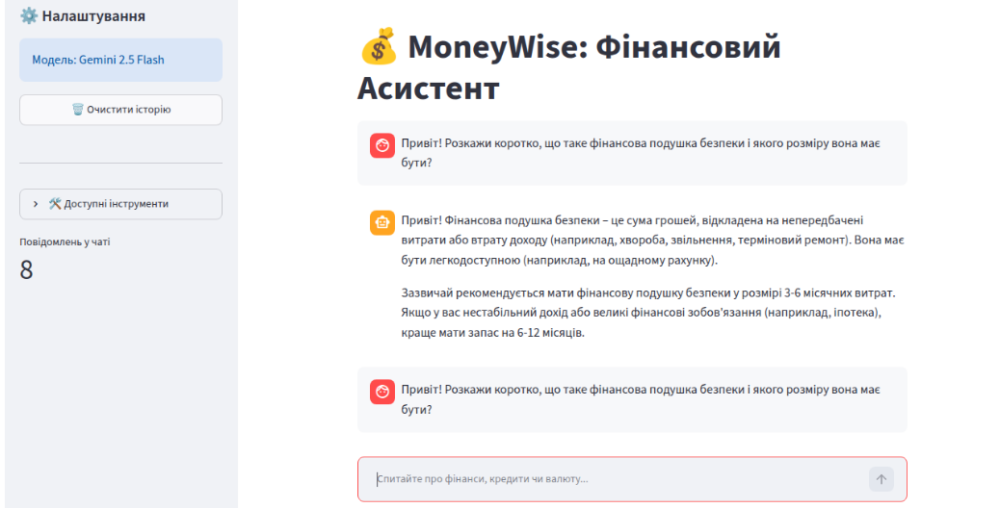
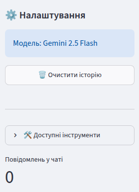
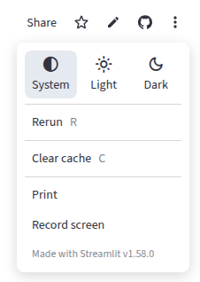

# 🤖 MoneyWise AI (Telegram Financial Assistant)

👉 **Спробувати бота онлайн:** [@AlgoBudgetBot](https://t.me/AlgoBudgetBot)

MoneyWise — це розумний фінансовий асистент у Telegram, побудований на базі архітектури LangChain ReAct Agent та великої мовної моделі (LLM) Google Gemini. Бот здатний підтримувати природний діалог, запам'ятовувати контекст розмови та автономно використовувати спеціалізовані інструменти для вирішення фінансових задач користувача.

## 🖼 Приклади інтерфейсу

Ви можете переглянути візуалізацію роботи бота:
* **Діалог з ботом:**
  

* **Основне меню:**
  

* **Налаштування теми:**
  

## 🌟 Основні можливості (Features)

Бот працює як автономний агент і самостійно обирає потрібний інструмент з доступного арсеналу:

* 💱 **Конвертер валют:** Отримання актуальних курсів через API та миттєва конвертація.
* 📊 **Кредитний калькулятор:** Розрахунок ануїтетних та диференційованих платежів, формування графіка виплат та оцінка переплати.
* ⚖️ **Порівняння кредитів:** Аналіз кількох кредитних пропозицій для вибору найвигіднішої.
* 🎯 **Цілі заощаджень:** Розрахунок необхідних щомісячних внесків або часу для досягнення фінансової мети.
* 📉 **Калькулятор інфляції:** Оцінка втрати купівельної спроможності грошей з часом.
* 💼 **Оптимізатор бюджету:** Аналіз витрат користувача та порівняння їх із класичною моделлю "50/30/20".
* 🌐 **Пошук в Інтернеті:** Інтеграція з DuckDuckGo для пошуку актуальних фінансових новин та показників.

## 🧠 Архітектура пам'яті

У проєкті реалізовано гібридну систему пам'яті `ConversationSummaryBufferMemory`.

* **Buffer:** Точно зберігає останні повідомлення для виконання точних математичних розрахунків.
* **Summary:** Автоматично стискає старі повідомлення за допомогою LLM, генеруючи короткий конспект бесіди, що дозволяє економити токени та підтримувати довгі сесії без втрати загального контексту.

## 🛠 Технологічний стек

* **Мова:** Python 3.12
* **AI Фреймворк:** LangChain
* **LLM:** Google Gemini 2.5 Flash (`langchain-google-genai`)
* **Месенджер:** Telegram API (`pyTelegramBotAPI`)
* **Інше:** `requests` (для сторонніх API), `python-dotenv` (для безпеки ключів), кастомне логування подій агента у файл.

## 🚀 Встановлення та запуск (Local Setup)

1. **Клонуйте репозиторій:**

```bash
git clone https://github.com/ВАШ_ЮЗЕРНЕЙМ/MoneyWiseBot.git
cd MoneyWiseBot
```

2. **Створіть та активуйте віртуальне середовище:**

```bash
python -m venv venv
source venv/bin/activate   # Для Linux/macOS
# venv\Scripts\activate    # Для Windows
pip install -r requirements.txt
```

3. **Налаштуйте змінні середовища:**

Створіть файл `.env` у кореневій директорії проєкту та додайте ваші API-ключі:

```
GOOGLE_API_KEY=your_google_api_key_here
TELEGRAM_TOKEN=your_telegram_bot_token_here
```

4. **Запустіть бота:**

```bash
python main.py
```

## 📋 Доступні команди в Telegram

* `/start` — Розпочати роботу з ботом.
* `/memory` — Секретна команда розробника. Виводить поточний стан гібридної пам'яті для діагностики агента.

---

Розроблено як пет-проєкт для демонстрації інтеграції AI-агентів у реальні застосунки.